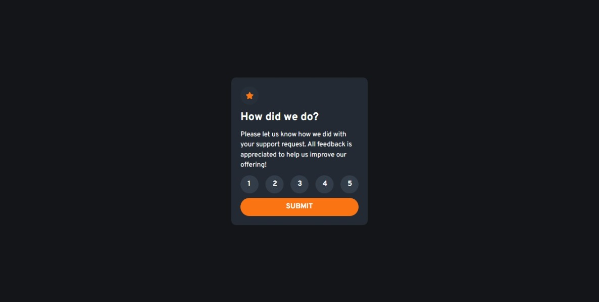
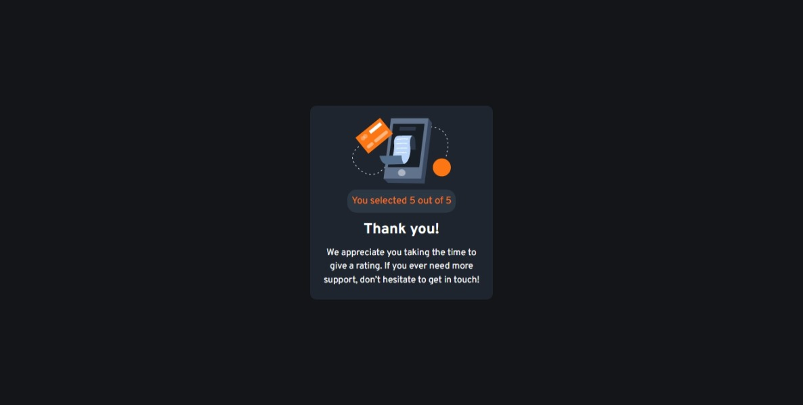

# Frontend Mentor - Interactive rating component solution

This is a solution to the [Interactive rating component challenge on Frontend Mentor](https://www.frontendmentor.io/challenges/interactive-rating-component-koxpeBUmI). Frontend Mentor challenges help you improve your coding skills by building realistic projects. 

## Table of contents

- [Overview](#overview)
  - [The challenge](#the-challenge)
  - [Screenshot](#screenshot)
  - [Links](#links)
- [My process](#my-process)
  - [Built with](#built-with)
  - [What I learned](#what-i-learned)
  - [Continued development](#continued-development)
  - [Useful resources](#useful-resources)
- [Author](#author)
- [Acknowledgments](#acknowledgments)

## Overview

### The challenge

Users should be able to:

- View the optimal layout for the app depending on their device's screen size
- See hover states for all interactive elements on the page
- Select and submit a number rating
- See the "Thank you" card state after submitting a rating

### Screenshot




### Links

- Solution URL: [Add solution URL here](https://your-solution-url.com)
- Live Site URL: [Add live site URL here](https://your-live-site-url.com)

## My process

### Built with

- Semantic HTML5 markup
- Flexbox
- Mobile-first workflow
- [React](https://reactjs.org/) - JS library
- [Next.js](https://nextjs.org/) - React framework
- [Chakra UI](https://chakra-ui.com/) - For styles

### What I learned

Using state and its implementation to; make a custom style for whether a button is active or not, to set what rating is chosen (1 from 5) and whether the form has been submitted or not. 
```js
const [isActive, setIsActive] = React.useState(null);
const [rating, setRating] = useState(null);
const [isSubmitted, setIsSubmitted] = useState(false);
```

Also create the function to set the state and know when to choose them. 
```js
const handleRatingChange = (rating) => {
    if (isActive === rating) setIsActive(null);
    else setIsActive(rating);
    setRating(rating + 1);
  };

const handleFormSubmit = (state) => {
    setIsSubmitted(state);
  };
```

Making a state to be the only source of truth and place them in the parent. In other words, lifting state up.
```js
{!isSubmitted ? (
    <RatingCard
        isActive={isActive}
        onRatingChange={handleRatingChange}
        onFormSubmit={handleFormSubmit}
    />
    ) : (
    <ThankYouCard rating={rating} />
    )}
```

### Continued development

- Creating more detailed component, like the page have a home layout and saving logic only on the most detailed component.
- Have a backend or database to store the rating added each time.

### Useful resources

- [Next JS Docs](https://nextjs.org/docs/)
- [Chakra UI Docs](https://chakra-ui.com/docs/)
- [Image Color Picker](https://imagecolorpicker.com/) - Somehow color guide in style guide doesnt match and make the style a mess.
- [Lifting State Up - React Docs](https://reactjs.org/docs/lifting-state-up.html) - How to lift a state up and make it the only source of truth.

## Author

- Frontend Mentor - [@taufiqmahdi](https://www.frontendmentor.io/profile/taufiqmahdi)
- Twitter - [@taufiqmhdi](https://www.twitter.com/taufiqmhdi)

## Acknowledgments

- [Mr. Faldi's Twitter](https://twitter.com/F2aldi) - The person I asked and get an insight when I was stuck on how to change active style on the rating button. Thanks mas Faldi! 